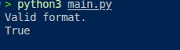

# Medical Records Validator 🏥🐍

A beginner-to-intermediate Python project that validates structured medical record data using real-world backend engineering concepts such as:

* Data validation
* Schema enforcement
* Regular expressions
* Type checking
* Error reporting
* Clean backend logic
* Defensive programming

This project simulates how healthcare systems, APIs, and backend services validate incoming patient records before saving them into a database.

---

# 🌍 Why This Project Exists

In real-world software systems — especially in healthcare, banking, cybersecurity, and enterprise applications — **bad data can break entire systems**.

Imagine:

* a patient's age stored as `"twenty"` instead of `20`
* a visit ID formatted incorrectly
* medications saved as numbers instead of strings
* missing patient identifiers

Small mistakes like these can lead to:

* corrupted databases
* failed API requests
* broken analytics
* security risks
* inaccurate medical decisions

This project was built to simulate how backend engineers protect systems by validating data before it enters production.

---

# 📖 Project Overview

The program validates a dataset of medical records and checks whether every patient record follows the expected structure and formatting rules.

Each record is validated for:

✅ Correct data type
✅ Required fields
✅ Proper string formatting
✅ Valid patient IDs
✅ Valid visit IDs
✅ Proper medication lists
✅ Valid age constraints
✅ Proper gender formatting

If invalid data is found, the program prints detailed error messages showing:

* the exact field
* the invalid value
* the position of the record

---

# 🧠 Backend Engineering Concepts Demonstrated

This project demonstrates several foundational backend development skills:

| Concept               | Purpose                                    |
| --------------------- | ------------------------------------------ |
| Data Validation       | Prevent invalid data from entering systems |
| Regex Validation      | Enforce structured ID formats              |
| Type Checking         | Ensure correct Python data types           |
| Defensive Programming | Handle unexpected input safely             |
| Dictionary Validation | Verify required schema fields              |
| List Iteration        | Process collections of records             |
| Boolean Constraints   | Build scalable validation logic            |
| Error Reporting       | Provide readable debugging messages        |

---

# 📂 Dataset Structure

Each patient record is represented as a Python dictionary.

Example:

```python
{
    'patient_id': 'P1001',
    'age': 34,
    'gender': 'Female',
    'diagnosis': 'Hypertension',
    'medications': ['Lisinopril'],
    'last_visit_id': 'V2301',
}
```

---

# 🔍 Validation Rules

## ✅ Patient ID

Must:

* be a string
* begin with `P` or `p`
* contain digits afterward

### Valid Examples

```python
P1001
p5002
```

### Invalid Examples

```python
PX100
patient01
```

---

## ✅ Age

Must:

* be an integer
* be at least 18

### Valid

```python
34
56
```

### Invalid

```python
"34"
15
```

---

## ✅ Gender

Must:

* be a string
* match either:

  * `"male"`
  * `"female"`

Case-insensitive validation is supported.

---

## ✅ Diagnosis

Must:

* be a string
* OR `None`

---

## ✅ Medications

Must:

* be a list
* contain only strings

### Valid

```python
['Insulin', 'Metformin']
```

### Invalid

```python
['Insulin', 500]
```

---

## ✅ Last Visit ID

Must:

* be a string
* follow the format:

  * `V2301`
  * `v9002`

---

# ⚙️ How the Validator Works

The application works in multiple stages.

---

## Stage 1 — Validate the Dataset

The program first checks whether the provided data is:

* a list
* or a tuple

Example:

```python
isinstance(data, (list, tuple))
```

---

## Stage 2 — Validate Each Record

Each item inside the dataset must be a dictionary.

Example:

```python
isinstance(dictionary, dict)
```

---

## Stage 3 — Validate Required Keys

Every record must contain the exact required fields.

Required keys:

```python
[
    'patient_id',
    'age',
    'gender',
    'diagnosis',
    'medications',
    'last_visit_id'
]
```

---

## Stage 4 — Validate Field Values

The program validates:

* data types
* value constraints
* regex patterns
* acceptable values

This logic lives inside:

```python
find_invalid_records()
```

---

# 🧪 Example Output

## Valid Dataset

```python
Valid format.
True
```

---

## Invalid Dataset Example

```python
Unexpected format 'age: 15' at position 0.
Unexpected format 'patient_id: PX100' at position 0.
False
```

---

# 🛠 Technologies Used

* Python 3
* Regular Expressions (`re` module)

---

# 🚀 How to Run the Project

## 1. Clone the Repository

```bash
git clone https://github.com/ikwukao/medical_records_validator.git
```

---

## 2. Navigate Into the Project Directory

```bash
cd medical_records_validator
```

---

## 3. Run the Program

```bash
python3 main.py
```

---

# 📚 What I Learned Building This

While building this project, I practiced:

* writing cleaner validation logic
* thinking like a backend engineer
* structuring defensive code
* improving readability with comments
* handling real-world data formats
* using regex in practical scenarios
* building scalable validation systems

More importantly, this project helped me understand that backend engineering is not just about APIs and databases — it’s also about **protecting system integrity through clean and reliable data handling**.

---

# 🎯 Ideal For

This project is useful for:

* Python beginners
* Backend engineering learners
* freeCodeCamp students
* API developers
* Data validation practice
* Junior developer portfolios

---

# 🔥 Future Improvements

Potential upgrades for this project:

* Add unit testing with `pytest`
* Export invalid records to a log file
* Add JSON file support
* Convert validator into a reusable API
* Add database integration
* Build a Flask or FastAPI version
* Add custom exception handling
* Create a frontend dashboard

---

# 📄 License

This project is open-source and free to use for educational purposes.

---

# 👨‍💻 Author

Built with Python as part of my backend engineering learning journey.

Currently sharpening my skills in:

* backend development
* system design fundamentals
* data validation
* APIs
* clean Python architecture
* real-world software engineering practices

## Program Output


